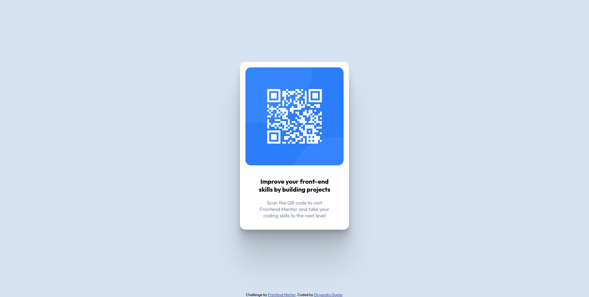
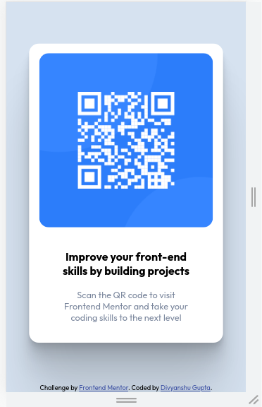

## Table of contents

- [Overview](#overview)
  - [Screenshot](#screenshot)
  - [Links](#links)
- [My process](#my-process)
  - [Built with](#built-with)
  - [What I learned](#what-i-learned)
  - [Continued development](#continued-development)
  - [Useful resources](#useful-resources)
- [Author](#author)

## Overview

### Screenshot





### Links

- Solution URL: [Github repo](https://github.com/FullBinaryAlchemist/Responsive-qr-code-card/)
- Live Site URL: [Github pages](https://fullbinaryalchemist.github.io/Responsive-qr-code-card/)

## My process

1. Start first with html markups 
2. Create a separate styles folder and then achieve the most basic styles like setting background, flex display, centering
3. Make responsive using "max-width" and "max-height" properties and using percentages wherever possible

### Built with

- Semantic HTML5 markup
- CSS custom properties
- Flexbox
- Mobile-first workflow


### What I learned


1. How to make responsive just using css and flexbox

2. Use box shadows

3. Use global css variables

```css
:root{
    --white: hsl(0, 0%, 100%);
    --light-gray: hsl(212, 45%, 89%);
    --grayish-blue: hsl(220, 15%, 55%);
    --dark-blue: hsl(218, 44%, 22%);
}
```

### Continued development

Further developements plans:
1. Refactor using SASS preprocessor
2. Set up css & html linting through prettier project level config
3. Rewrite as a React component
4. Deploy as a Next.js website
5. Improve accessiblity
### Useful resources

- [Page ruler](https://chrome.google.com/webstore/detail/page-ruler-redux/giejhjebcalaheckengmchjekofhhmal) - To measure the sizes and make as pixel perfect as possible
- [Mozilla responsive image docs](https://www.example.com) - Readup on responsive images guidelines.
- [Box shadow](https://css-tricks.com/almanac/properties/b/box-shadow/) - Box shadows for reference.
- [Naming convention](https://stackoverflow.com/questions/7927193/css-class-naming-convention)
## Author

- Website - [Divyanshu Gupta](https://in.linkedin.com/in/dg-divyanshu-gupta)

